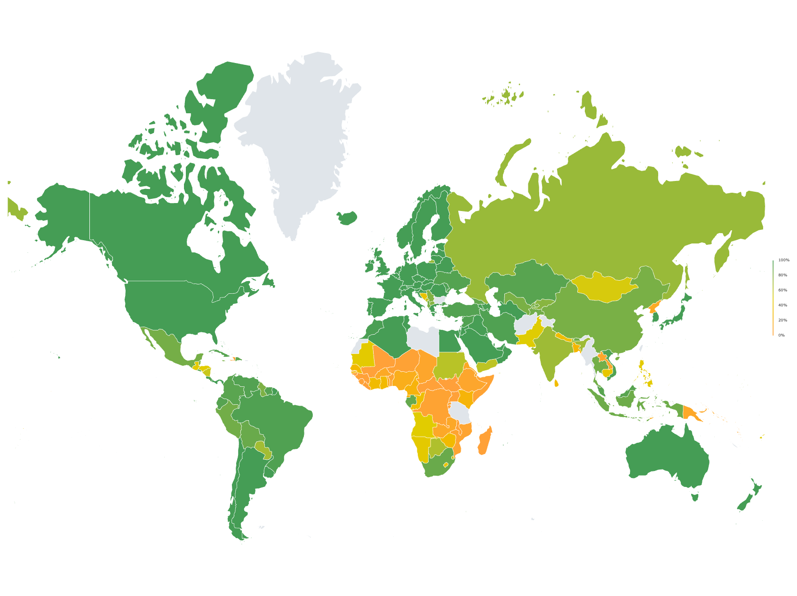

# JavaScript Charting Library

<div align="center">
    <picture>
      <source media="(prefers-color-scheme: dark)" srcset="https://github.com/ag-grid/ag-grid/blob/latest/documentation/ag-grid-docs/public/images/ag-logos/svg-logos/AG-Charts-Logo_Dark-Theme.svg?raw=true"/>
      <source media="(prefers-color-scheme: light)" srcset="https://github.com/ag-grid/ag-grid/blob/latest/documentation/ag-grid-docs/public/images/ag-logos/svg-logos/AG-Charts-Logo_Light-Theme.svg?raw=true"/>
      
    </picture>
    <div align="center">
        <h4><a href="https://charts.ag-grid.com">🌐 Website</a> • <a href="https://www.ag-grid.com/javascript-data-grid/getting-started/">📖 Documentation</a> • <a href="https://charts.ag-grid.com/gallery/">📊 Gallery</a></h4>
    </div>
    <br>
    <a href="https://github.com/ag-grid/ag-charts/releases">
        
    </a>
    <a href="https://www.npmjs.com/package/ag-charts-community">
        
    </a>
    <a href="https://github.com/ag-grid/ag-charts">
        
    </a>
    <a href="https://github.com/ag-grid/ag-charts">
        
    </a>
    <br><br>
    <a href="https://sonarcloud.io/dashboard?id=ag-charts-community">
      
    </a>
    <a href="https://npm.io/package/ag-charts-community">
        
    </a>
    <a href="https://github.com/ag-grid/ag-charts/graphs/commit-activity">
        
    </a>
    <a href="https://github.com/ag-grid/ag-charts/network/dependents">
        
    </a>
    <br><br>
    <p>AG Charts is a <strong>fully-featured</strong> and <strong>highly customizable</strong> canvas-based JavaScript Charting library. It delivers <strong>outstanding performance</strong>, has <strong>no third-party dependencies</strong> and comes with support for <strong><a href="https://github.com/ag-grid/ag-charts/tree/latest/packages/ag-charts-react"> React</a></strong>, <strong><a href="https://github.com/ag-grid/ag-charts/tree/latest/packages/ag-charts-angular"> Angular</a></strong> and <strong><a href="https://github.com/ag-grid/ag-charts/tree/latest/packages/ag-charts-vue3"> Vue</a></strong>.</p>
    <br>
</div>

<picture>
    <source media="(prefers-color-scheme: dark)" srcset="./packages/ag-charts-website/public/images/readme-assets/gallery-dark.gif"/>
    <source media="(prefers-color-scheme: light)" srcset="./packages/ag-charts-website/public/images/readme-assets/gallery.gif"/>
    
</picture>
<div align="right">
    <a href="https://charts.ag-grid.com/examples/"><br>
</a>
</div>

## 📖 Overview

<details>
  <summary><strong>Table of Contents</strong></summary>

-   [📖 Overview](#-overview)
    -   [Chart Types](#chart-types)
    -   [Features](#features)
    -   [Financial Charts](#financial-charts)
    -   [Map Charts](#map-charts)
-   [⚡️ Quick Start](#️-quick-start)
    -   [Installation](#installation)
    -   [Setup](#setup)
-   [🤝 Support](#-support)
    -   [Enterprise Support](#enterprise-support)
    -   [Bug Reports](#bug-reports)
    -   [Questions](#questions)
    -   [Contributing](#contributing)
-   [⚠️ License](#️-license)

</details>

AG Charts is available in two versions: Community & Enterprise.

-   `ag-charts-community` is free, available under the MIT license, and comes with core series types, such as Pie, Area, Bar, Scatter Charts, in addition to all of the key features expected from a JavaScript charting library, including Accessibility, Tooltips, Themes, Markers, Legends, Axis Types and Secondary Axes.
-   `ag-charts-enterprise` is available under a commercial license and comes with additional series types, such as Financial Charts, Maps, Sankey, Radar, and Waterfall Charts as well as advanced interactivity features, like Animations, Context Menus, Zooming, Navigators, Synchronization and much more.

### Chart Types

| Chart Type                                                            | AG Charts Community | AG Charts Enterprise |
| --------------------------------------------------------------------- | ------------------- | -------------------- |
| [Bar](https://charts.ag-grid.com/gallery/simple-bar/)                 | ✅                  | ✅                   |
| [Line](https://charts.ag-grid.com/gallery/multiple-line-series/)      | ✅                  | ✅                   |
| [Area](https://charts.ag-grid.com/gallery/stacked-area/)              | ✅                  | ✅                   |
| [Scatter](https://charts.ag-grid.com/gallery/simple-scatter/)         | ✅                  | ✅                   |
| [Bubble](https://charts.ag-grid.com/gallery/simple-bubble/)           | ✅                  | ✅                   |
| [Pie](https://charts.ag-grid.com/gallery/simple-pie/)                 | ✅                  | ✅                   |
| [Doughnut](https://charts.ag-grid.com/gallery/multiple-donuts/)       | ✅                  | ✅                   |
| [Combination](https://charts.ag-grid.com/gallery/combination-chart/)  | ✅                  | ✅                   |
| [Box Plot](https://charts.ag-grid.com/gallery/simple-box-plot/)       | ❌                  | ✅                   |
| [Bullet](https://charts.ag-grid.com/gallery/simple-bullet/)           | ❌                  | ✅                   |
| [Candlestick](https://charts.ag-grid.com/gallery/candlestick-chart/)  | ❌                  | ✅                   |
| [OHLC](https://charts.ag-grid.com/gallery/ohlc-chart/)                | ❌                  | ✅                   |
| [Heatmap](https://charts.ag-grid.com/gallery/heatmap-with-labels/)    | ❌                  | ✅                   |
| [Histogram](https://charts.ag-grid.com/gallery/simple-histogram/)     | ❌                  | ✅                   |
| [Nightingale](https://charts.ag-grid.com/gallery/simple-nightingale/) | ❌                  | ✅                   |
| [Radar](https://charts.ag-grid.com/gallery/radar-area-with-labels/)   | ❌                  | ✅                   |
| [Radial](https://charts.ag-grid.com/gallery/simple-radial-column/)    | ❌                  | ✅                   |
| [Range](https://charts.ag-grid.com/gallery/simple-range-area/)        | ❌                  | ✅                   |
| [Sunburst](https://charts.ag-grid.com/gallery/simple-sunburst/)       | ❌                  | ✅                   |
| [Treemap](https://charts.ag-grid.com/gallery/treemap/)                | ❌                  | ✅                   |
| [Waterfall](https://charts.ag-grid.com/gallery/customised-waterfall/) | ❌                  | ✅                   |
| [Sankey](https://charts.ag-grid.com/gallery/sankey/)                  | ❌                  | ✅                   |
| [Chord](https://charts.ag-grid.com/gallery/chord-diagram/)            | ❌                  | ✅                   |

### Features

| Feature                                                                           | AG Charts Community | AG Charts Enterprise |
| --------------------------------------------------------------------------------- | ------------------- | -------------------- |
| [Accessibility](https://charts.ag-grid.com/javascript/accessibility/)             | ✅                  | ✅                   |
| [Localisation](https://charts.ag-grid.com/javascript/localisation/)               | ✅                  | ✅                   |
| [Series Highlighting](https://charts.ag-grid.com/javascript/series-highlighting/) | ✅                  | ✅                   |
| [Tooltips](https://charts.ag-grid.com/javascript/tooltips/)                       | ✅                  | ✅                   |
| [Animations](https://charts.ag-grid.com/javascript/animation/)                    | ❌                  | ✅                   |
| [Context Menu](https://charts.ag-grid.com/javascript/context-menu/)               | ❌                  | ✅                   |
| [Crosshairs](https://charts.ag-grid.com/javascript/axes-crosshairs/)              | ❌                  | ✅                   |
| [Navigator](https://charts.ag-grid.com/javascript/navigator/)                     | ❌                  | ✅                   |
| [Synchronization](https://charts.ag-grid.com/javascript/sync/)                    | ❌                  | ✅                   |
| [Zoom](https://charts.ag-grid.com/javascript/zoom/)                               | ❌                  | ✅                   |

### Financial Charts

Build interactive financial charts featuring advanced annotations with minimal configuration, all you need to do is provide your data:

```js
const options = {
    data: getData(),
};

AgCharts.createFinancialChart(options);
```

Once created, users will have a Financial Chart that can interact with and add annotations to.

<picture>
    <source media="(prefers-color-scheme: dark)" srcset="./packages/ag-charts-website/public/images/readme-assets/financial-charts-annotations.gif"/>
    <source media="(prefers-color-scheme: light)" srcset="./packages/ag-charts-website/public/images/readme-assets/financial-charts-annotations-light.gif"/>
    
    <br>
</picture>

The default chart type is [Candlestick](https://charts.ag-grid.com/javascript/candlestick-series/), with additional types like [OHLC](https://charts.ag-grid.com/javascript/ohlc-series/) and [Line](https://charts.ag-grid.com/javascript/line-series/) for versatile data visualisation.

<a href="https://charts.ag-grid.com/javascript/maps/"><br></a>

### Map Charts

Map Charts let you visualise geographic data in different ways.



To create a Map Shape Series, use the map-shape series type and provide data and [topology](https://charts.ag-grid.com/javascript/map-topology/). These can be provided in either the chart or series objects.

```js
topology: topology,
series: [
    {
        type: 'map-shape',
        data: pacific,
        idKey: 'name',
        title: 'Pacific'
    },
    // ...
],
legend: {
    enabled: true,
}
```

<a href="https://charts.ag-grid.com/javascript/maps/"></a>

## ⚡️ Quick Start

AG Grid is easy to set up - all you need to do is provide your data and define your column structure. Read on for vanilla JavaScript installation instructions, or refer to our framework-specific guides for <strong><a href="https://github.com/ag-grid/ag-grid/tree/latest/packages/ag-grid-react"> React</a></strong>, <strong><a href="https://github.com/ag-grid/ag-grid/tree/latest/packages/ag-grid-angular"> Angular</a></strong> and <strong><a href="https://github.com/ag-grid/ag-grid/tree/latest/packages/ag-grid-vue"> Vue</a></strong>.

### Installation

```sh
$ npm install ag-charts-community
```

### Setup

1. Provide a Container

```html
<!doctype html>
<html lang="en">
    <head>
        <title>AG Charts Quick Start</title>
        <!-- JavaScript Charts Core Library -->
        <script src="https://cdn.jsdelivr.net/npm/ag-charts-community/dist/umd/ag-charts-community.js"></script>
    </head>
    <body>
        <!-- Container for Chart -->
        <div id="myChart"></div>
        <!-- Charts configuration file -->
        <script src="index.js"></script>
    </body>
</html>
```

2. Instantiate the JavaScript Chart

```js
// Chart Options
const options = {};

// Create Chart
const chart = agCharts.AgCharts.create(options);
```

3. Define Chart Data and Series

```js
// Chart Options
const options = {
    // Container: HTML Element to hold the chart
    container: document.getElementById('myChart'),
    // Data: Data to be displayed in the chart
    data: [
        { month: 'Jan', avgTemp: 2.3, iceCreamSales: 162000 },
        { month: 'Mar', avgTemp: 6.3, iceCreamSales: 302000 },
        { month: 'May', avgTemp: 16.2, iceCreamSales: 800000 },
        { month: 'Jul', avgTemp: 22.8, iceCreamSales: 1254000 },
        { month: 'Sep', avgTemp: 14.5, iceCreamSales: 950000 },
        { month: 'Nov', avgTemp: 8.9, iceCreamSales: 200000 },
    ],
    // Series: Defines which chart type and data to use
    series: [{ type: 'bar', xKey: 'month', yKey: 'iceCreamSales' }],
};
```

> [!IMPORTANT]
> For more information on building JavaScript Charts with AG Charts, refer to our [Documentation](https://charts.ag-grid.com/javascript/quick-start/).

## 🤝 Support

### Enterprise Support

AG Charts Enterprise customers have access to dedicated support via [ZenDesk](https://ag-grid.zendesk.com/hc/en-us), which is monitored by our engineering teams.

### Bug Reports

If you have found a bug, please report it in this repository's [issues](https://github.com/ag-grid/ag-charts/issues) section.


### Questions

Look for similar problems on [StackOverflow](https://stackoverflow.com/questions/tagged/ag-charts) using the `ag-charts` tag. If nothing seems related, post a new message there. Please do not use GitHub issues to ask questions.


### Contributing

AG Charts is developed by a team of co-located developers in London. If you want to join the team send your application to info@ag-grid.com.

## ⚠️ License

`ag-charts-community` is licensed under the **MIT** license.

`ag-charts-enterprise` has a **Commercial** license.

See the [LICENSE file](./LICENSE.txt) for more info.

<div><h2>AG Grid</h2></div>

TODO:

Learn more at [ag-grid.com](https://ag-grid.com/)

<div align="center">
    
<hr/>

<strong>Follow us to keep up to date with all the latest news from AG Grid:</strong>

<a href="https://x.com/ag_grid"></a>
<a href="https://www.linkedin.com/company/ag-grid/"></a>
<a href="https://www.youtube.com/c/ag-grid"></a>
<a href="https://blog.ag-grid.com"></a>

</div>
