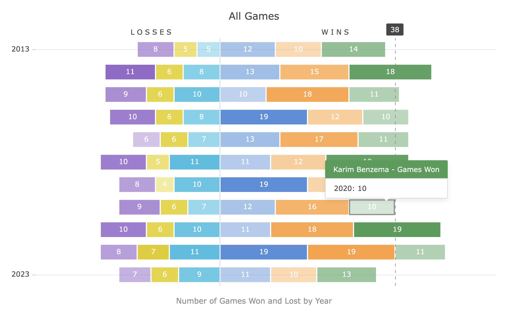

<picture><source media="(prefers-color-scheme: dark)" srcset="./.github/banner-dark.png"><source media="(prefers-color-scheme: light)" srcset="./.github/banner-light.png"></picture>

 

| Module               |                                                                                                                                                                                                                                                                                                        Info |
| -------------------- | ----------------------------------------------------------------------------------------------------------------------------------------------------------------------------------------------------------------------------------------------------------------------------------------------------------: |
| ag-charts-community  |       |
| ag-charts-enterprise |        |

# AG Charts

AG Charts is a fully-featured and highly customizable JavaScript charting library. The professional choice for developers building enterprise applications.

It delivers [outstanding performance](https://charts.ag-grid.com/?utm_source=ag-grid-readme&utm_medium=repository&utm_campaign=github), has no third-party dependencies and [integrates smoothly with all major JavaScript frameworks](https://charts.ag-grid.com/javascript/quick-start?utm_source=ag-grid-readme&utm_medium=repository&utm_campaign=github).

## Examples

<picture><source media="(prefers-color-scheme: dark)" srcset="./.github/example-1-dark.png"><source media="(prefers-color-scheme: light)" srcset="./.github/example-1-light.png"></picture>

## Features

Here are some of the features that make AG Charts stand out:

-   Modern, lightweight and performant.
-   Framework agnostic:
    -   thin reactive wrappers for your chosen framework: React, Angular, Vue;
    -   or use our plain Javascript API with 1st-class Typescript support.
-   Zero dependencies.
-   Simple & clean declarative configuration.
-   Comprehensive interactive documentation.

<table>
    <thead>
        <th colspan="2">
            Supported Chart Types
        </th>
        <th colspan="1">
            Advanced Features
        </th>
    </thead>
    <tbody>
        <tr>
            <td>
                Line, Bar & Area 
                Scatter & Bubble   
                Pie & Donut 
                Histogram 
                Map* 
                Candlestick & OHLC* 
                Box Plot* 
            </td>
            <td>
                Heatmap* 
                Nightingale* 
                Range (Bar, Area)* 
                Radar (Area, Line, Bar, Column)* 
                Sunburst & Treemap* 
                Bullet* 
                 
            </td>
            <td>
                Cross-lines 
                Secondary Axes 
                Theming 
                Animation* 
                Multi-chart Synchronisation* 
                Cross-hairs* 
                Error-bars* 
            </td>
        </tr>
    </tbody>
    <tfoot>
        <td colspan="3">
            * These are available in the [Enterprise version](https://charts.ag-grid.com/license-pricing/?utm_source=ag-grid-readme&utm_medium=repository&utm_campaign=github) only.
        </td>
    </tfoot>
</table>
 

Check out the [developer documentation](https://charts.ag-grid.com/javascript/?utm_source=ag-grid-readme&utm_medium=repository&utm_campaign=github) for a complete list of features or visit [our official docs](https://charts.ag-grid.com/gallery/?utm_source=ag-grid-readme&utm_medium=repository&utm_campaign=github) for tutorials and feature demos.

## Getting started

Get started with [React](https://charts.ag-grid.com/react/quick-start/?utm_source=ag-charts-readme&utm_medium=repository&utm_campaign=github) / [Angular](https://charts.ag-grid.com/angular/quick-start/?utm_source=ag-charts-readme&utm_medium=repository&utm_campaign=github) / [Vue](https://charts.ag-grid.com/vue/quick-start/?utm_source=ag-charts-readme&utm_medium=repository&utm_campaign=github) / [Javascript](https://charts.ag-grid.com/javascript/quick-start/?utm_source=ag-charts-readme&utm_medium=repository&utm_campaign=github).

Installation for [React](https://charts.ag-grid.com/react/installation/) / [Angular](https://charts.ag-grid.com/angular/installation/) / [Vue](https://charts.ag-grid.com/vue/installation/) / [Javascript](https://charts.ag-grid.com/javascript/installation/).

## Issue Reporting

If you have found a bug, please report it in this repository's [issues](https://github.com/ag-grid/ag-charts/issues) section. If you're using the Enterprise version, please use the [private ticketing](https://ag-grid.zendesk.com/) system to do that.

## Asking Questions

Look for similar problems on [StackOverflow](https://stackoverflow.com/questions/tagged/ag-charts) using the `ag-charts` tag. If nothing seems related, post a new message there. Please do not use GitHub issues to ask questions.

## Contributing

AG Charts is developed by a team of co-located developers in London. If you want to join the team send your application to info@ag-grid.com.

## License

This project is licensed under the MIT license. See the [LICENSE file](./LICENSE.txt) for more info.
