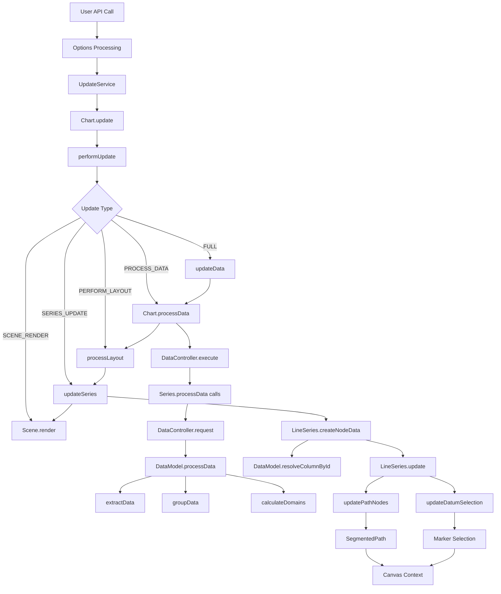

# Data Flow Analysis: From API to Scene Graph

## Executive Summary

This document traces the complete data flow from `AgCharts.create()` and `AgChartInstance.update()` API calls through to scene graph rendering, with specific focus on LineSeries. It identifies the current pipeline stages, performance characteristics, and bottlenecks that the high-frequency update design aims to address.

## Key Performance Findings

Based on empirical analysis with 1M data points:

-   **Data Processing**: 393ms (68% of total time)
-   **Canvas Rendering**: 3-4ms (<1% of total time)
-   **Other Operations**: ~183ms (axis calculations, layout, etc.)

**Critical Insight**: Data processing is the primary bottleneck, not rendering. Optimizations should focus on incremental data processing rather than rendering culling.

## Data Flow Overview



## Stage 1: API Entry Points

### 1.1 Chart Creation

**File**: `packages/ag-charts-community/src/api/agCharts.ts:67-91`

```typescript
AgCharts.create(userOptions) {
    // Deep clone options for mutation detection
    userOptions = deepFreeze(deepClone(userOptions));

    // Create or update chart instance
    const chart = AgChartsInternal.createOrUpdate({
        userOptions,
        licenseManager,
        optionsMetadata,
        apiStartTime
    });

    return chart;
}
```

### 1.2 Chart Updates

**File**: `packages/ag-charts-community/src/chart/chartProxy.ts:78-95`

```typescript
AgChartInstance.update(options) {
    this.factoryApi.update(options, this, undefined, apiStartTime);
    await this.chart?.waitForUpdate();
}

AgChartInstance.updateDelta(deltaOptions) {
    this.factoryApi.updateUserDelta(this, deltaOptions, apiStartTime);
    await this.chart?.waitForUpdate();
}
```

## Stage 2: Options Processing

### 2.1 ChartOptions Creation

**File**: `packages/ag-charts-community/src/api/agCharts.ts:213-227`

```typescript
const chartOptions = new ChartOptions(
    baseOptions, // Previous options (if updating)
    options, // New user options
    processedOverrides,
    specialOverrides,
    optionsMetadata,
    deltaOptions,
    stripSymbols,
    apiStartTime
);
```

**Current Bottleneck**: Full options reconciliation on every update, even for data-only changes.

### 2.2 Options Application

**File**: `packages/ag-charts-community/src/chart/chart.ts:1266-1380`

```typescript
Chart.applyOptions(newChartOptions) {
    // Apply series (potentially replacing all)
    const seriesStatus = this.applySeries(...);

    // Determine update type based on changes
    const forceNodeDataRefresh = this.shouldForceNodeDataRefresh(deltaOptions, seriesStatus);
    const updateType = majorChange ? ChartUpdateType.FULL : minimumUpdateType;

    // Trigger update pipeline
    this.update(updateType, {
        apiUpdate: true,
        forceNodeDataRefresh,
        newAnimationBatch: true
    });
}
```

## Stage 3: Update Pipeline

### 3.1 UpdateService Coordination

**File**: `packages/ag-charts-community/src/chart/updateService.ts:56-58`

```typescript
UpdateService.update(type = ChartUpdateType.FULL, options?: UpdateOpts) {
    this.updateCallback(type, options);
}
```

### 3.2 Chart Update Method

**File**: `packages/ag-charts-community/src/chart/chart.ts:596-621`

```typescript
Chart.update(type = ChartUpdateType.FULL, opts?: UpdateOpts) {
    const { forceNodeDataRefresh, skipAnimations, seriesToUpdate } = opts;

    if (forceNodeDataRefresh) {
        // Mark all series data as dirty - forces full reprocessing
        this.series.forEach((series) => series.markNodeDataDirty());
    }

    // Debounced trigger to performUpdate
    this.performUpdateTrigger.schedule();
}
```

**Current Bottleneck**: `forceNodeDataRefresh` commonly triggers full data reprocessing.

### 3.3 performUpdate Execution

**File**: `packages/ag-charts-community/src/chart/chart.ts:681-750`

The update cascade follows this hierarchy:

1. **FULL**: Complete update including DOM
2. **UPDATE_DATA**: Push data to series (`chart.data` → series)
3. **PROCESS_DATA**: Process series data, calculate domains
4. **PERFORM_LAYOUT**: Calculate layout
5. **SERIES_UPDATE**: Update series visual nodes
6. **SCENE_RENDER**: Render to canvas

## Stage 4: Data Processing (LineSeries)

### 4.1 Data Reception

**File**: `packages/ag-charts-community/src/chart/chart.ts:1037-1041`

```typescript
async updateData() {
    // Push entire data array to each series
    this.series.forEach((s) => s.setChartData(this.data));
}
```

**Current Bottleneck**: Complete data array replacement on every update.

### 4.2 LineSeries.processData

**File**: `packages/ag-charts-community/src/chart/series/cartesian/lineSeries.ts:139-222`

```typescript
async processData(dataController: DataController) {
    // Build property definitions for data extraction
    const props: DataModelOptions['props'] = [
        valueProperty(xKey, xScaleType, { id: 'xValue' }),
        valueProperty(yKey, yScaleType, { id: 'yValueRaw' }),
        // ... additional properties for stacked/normalized series
    ];

    // Request DataModel from DataController
    const { dataModel, processedData } = await this.requestDataModel(
        dataController,
        data,
        {
            props,
            groupByKeys: stacked,
            groupByData: !stacked
        }
    );

    // Store for later use in createNodeData
    this.dataModel = dataModel;
    this.processedData = processedData;
}
```

### 4.3 DataController Coordination

**File**: `packages/ag-charts-community/src/chart/data/dataController.ts:46-127`

The DataController acts as a central coordinator for data processing across all series:

```typescript
class DataController {
    // Collects all series data requests
    async request(id: string, data: D[], opts: DataModelOptions) {
        this.requested.push({ id, opts, data, resolve, reject });
    }

    // Executes all requests together
    execute(cachedData?: CachedData): CachedData {
        // 1. Validate all requests
        const valid = this.validateRequests(this.requested);

        // 2. Merge compatible requests for efficiency
        const merged = this.mergeRequested(valid);

        // 3. Process each merged group
        for (const { data, ids, opts, resolves } of merged) {
            // Check cache for reusable processed data
            const reusableCache = cachedData?.find(/*...*/);

            if (!reusableCache) {
                // Create new DataModel and process
                dataModel = new DataModel(opts, mode);
                processedData = dataModel.processData(sources);
            }

            // Resolve all series waiting for this data
            resolves.forEach((resolve) => resolve({ dataModel, processedData }));
        }
    }
}
```

**Key Role**: DataController enables data sharing between series when they use the same source data, avoiding redundant processing.

### 4.4 DataModel Processing

**File**: `packages/ag-charts-community/src/chart/data/dataModel.ts:568-610`

The DataModel is responsible for the heavy lifting of data transformation:

```typescript
class DataModel {
    processData(sources: Map<string, unknown[]>): ProcessedData {
        // 1. Extract raw data from sources
        let processedData = this.extractData(sources);

        // 2. Group data if required (for stacked series)
        if (groupByKeys) {
            processedData = this.groupData(processedData);
        }

        // 3. Apply group processors (cumulative values for stacking)
        if (groupProcessors.length > 0) {
            this.postProcessGroups(processedData);
        }

        // 4. Calculate domains (min/max values)
        this.calculateDomains(processedData);

        return processedData;
    }

    // Provides column access for series
    resolveColumnById(scope, searchId, processedData): T[] {
        const index = this.resolveProcessedDataIndexById(scope, searchId);
        return processedData.columns[index];
    }

    // Provides domain (min/max) for axes
    getDomain(scope, searchId, type, processedData): [number, number] {
        const domains = this.getDomainsByType(type, processedData);
        return domains[this.resolveProcessedDataIndexById(scope, searchId)];
    }
}
```

**Key Responsibilities**:

-   Extracts values from raw data using property definitions
-   Handles grouping for stacked series
-   Calculates cumulative values
-   Computes domains for axis scaling
-   Provides efficient column-based data access

**Current Bottleneck**:

-   Creates new DataModel instance on every update
-   Reprocesses entire dataset from scratch
-   No incremental domain calculation

## Stage 5: Node Data Creation

### 5.1 LineSeries.createNodeData with DataModel

**File**: `packages/ag-charts-community/src/chart/series/cartesian/lineSeries.ts:330-484`

```typescript
createNodeData() {
    const { dataModel, processedData } = this;

    // Extract processed columns from DataModel
    const xValues = dataModel.resolveColumnById(this, 'xValue', processedData);
    const yRawValues = dataModel.resolveColumnById(this, 'yValueRaw', processedData);
    const yCumulativeValues = dataModel.resolveColumnById(this,
        this.yCumulativeKey(processedData), processedData);

    // Get domain for label formatting
    const yDomain = this.getSeriesDomain(ChartAxisDirection.Y);

    const nodeData: LineNodeDatum[] = [];
    const spanPoints: SpanPoints = [];

    // Process visible range with lookahead/behind
    let [start, end] = this.visibleRangeIndices('xValue', xAxis.range);
    start = Math.max(start - 1, 0);
    end = Math.min(end + 1, xValues.length);

    // Iterate through data points
    for (let i = start; i < end; i++) {
        const xDatum = xValues[i];
        const yDatum = yRawValues[i];
        const yCumulative = yCumulativeValues[i];

        const x = xScale.convert(xDatum) + xOffset;
        const y = yScale.convert(yCumulative) + yOffset;

        nodeData.push({
            series: this,
            datum: rawData[i],
            datumIndex: i,
            point: { x, y, size },
            yValue: yDatum,
            xValue: xDatum,
            cumulativeValue: yCumulative,
            // ... other properties
        });
    }

    return {
        nodeData,
        strokeData,
        segments,
        // ... other context data
    };
}
```

**DataModel Usage**:

-   `resolveColumnById()` provides efficient columnar access to processed data
-   Columns are pre-calculated during `processData()` stage
-   Cumulative values for stacking are already computed
-   Domains are available for axis scaling

**Optimization Opportunity**: Visible range calculation could be leveraged for incremental updates.

## Stage 6: Scene Graph Updates

### 6.1 Series Update

**File**: `packages/ag-charts-community/src/chart/series/cartesian/cartesianSeries.ts:380-400`

```typescript
update({ seriesRect }) {
    const resize = this.checkResize(seriesRect);
    const itemHighlighted = this.updateHighlightSelection();

    this.contentGroup.batchedUpdate(() => {
        const dataChanged = this.updateSelections();
        this.updateNodes(itemHighlighted, resize || dataChanged);
    });
}
```

### 6.2 Path Node Updates

**File**: `packages/ag-charts-community/src/chart/series/cartesian/lineSeries.ts:490-523`

```typescript
updatePathNodes(opts) {
    const lineNode = opts.paths[0];
    const segments = this.contextNodeData?.segments;

    lineNode.setProperties({
        segments,
        stroke,
        strokeWidth,
        strokeOpacity,
        lineDash,
        // ... other visual properties
    });

    lineNode.datum = segments;
}
```

### 6.3 Datum Selection Updates

**File**: `packages/ag-charts-community/src/chart/series/cartesian/lineSeries.ts:525-546`

```typescript
updateDatumSelection(opts) {
    const markersEnabled = markerEnabled(
        processedData.input.count,
        axes[ChartAxisDirection.X].scale,
        marker
    );

    nodeData = markersEnabled ? nodeData : [];

    return datumSelection.update(
        nodeData,
        undefined,
        (datum) => createDatumId(datum.xValue)
    );
}
```

## Stage 7: Canvas Rendering

### 7.1 Scene Render Trigger

**File**: `packages/ag-charts-community/src/chart/chart.ts:750`

```typescript
case ChartUpdateType.SCENE_RENDER:
    await ctx.scene.render();
```

### 7.2 Canvas Operations

The scene graph nodes (SegmentedPath, Marker) are rendered to canvas context with:

-   Full canvas clear and redraw
-   No partial rendering or dirty rectangles
-   Empirically measured at 3-4ms for complex charts

**Key Finding**: Rendering is already highly optimized. Culling strategies would provide negligible benefit.

## Critical Bottlenecks Identified

1. **Options Reconciliation** (Stage 2)

    - Full deep clone and reconciliation on every update
    - No distinction between data and configuration changes

2. **Data Replacement** (Stage 4.1)

    - Entire data array pushed to series
    - No incremental update capability

3. **DataController & DataModel Reprocessing** (Stage 4.2-4.4)

    - New DataController created each time
    - New DataModel instances for every update
    - Complete re-extraction of all data values
    - Full domain recalculation from scratch
    - No reuse of processed columns
    - Property definitions rebuilt on every cycle

4. **Node Recreation** (Stage 5)
    - All node data recreated
    - No reuse of existing nodes
    - DataModel columns accessed but immediately discarded

## Optimization Opportunities

### Immediate (Phase 1)

1. **Incremental Data Processing**

    - Track data changes via unique IDs
    - Update only affected data points
    - Incremental domain calculations
    - Reuse DataModel processed columns where possible
    - Cache property definitions between updates

2. **Direct Data Mutation Paths**
    - Bypass options reconciliation for data-only updates
    - Dedicated `applyDataTransaction()` API
    - Direct updates to DataModel columns for add/update/remove operations

### Future (Phase 2)

1. **Batched Updates**

    - Queue multiple updates
    - Process in animation frames
    - Coalesce redundant changes

2. **Memory Pooling**
    - Reuse node data objects
    - TypedArray backing for numeric data

## Performance Targets

Based on current measurements:

-   **Current**: 580ms for 1M points (393ms data processing)
-   **Phase 1 Target**: 120-140ms (60-70% reduction via delta processing)
-   **Phase 2 Target**: <50ms (additional 10-15% via batching)

## References

-   Design Document: [DESIGN_DOC.md](./DESIGN_DOC.md)
-   Performance Insights: [PERFORMANCE-INSIGHTS-SUMMARY.md](./PERFORMANCE-INSIGHTS-SUMMARY.md)
-   Implementation Options: [COMPARISON-MATRIX.md](./COMPARISON-MATRIX.md)
