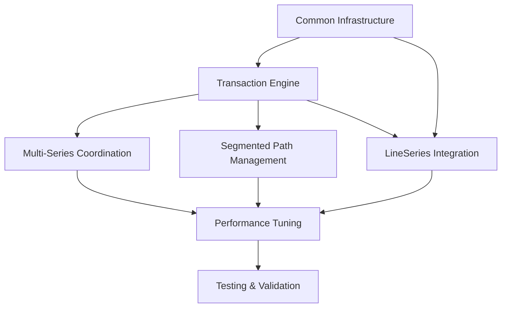

# Line Series Feasibility Analysis - Option 1: Incremental Update API

## Executive Summary

This analysis evaluates the feasibility of implementing Option 1's transaction-based incremental update API specifically for LineSeries. The analysis focuses on Option 1's unique aspects beyond the common infrastructure, examining how transaction operations map to line rendering, the integration complexity with existing LineSeries architecture, and performance characteristics specific to the incremental approach.

**Key Finding**: Option 1 presents moderate implementation complexity with excellent performance characteristics for typical financial data scenarios. The transaction-based approach aligns well with LineSeries operations and provides predictable performance patterns that scale linearly with change size rather than dataset size. With rendering already optimized (~3-4ms), the focus is on data processing optimization which represents 68% of total execution time (~393ms out of 580ms for 1M points).

## 1. Transaction to LineSeries Operation Mapping

### 1.1 Append Operations → Path Extension

**Current LineSeries Implementation:**

```typescript
// Existing processData() - Full regeneration
processData() {
    this.nodeData = this.data.map(datum => new LineNode(datum));
    this.path = this.generateCompletePath(this.nodeData);
}
```

**Option 1 Enhancement:**

```typescript
class TransactionalLineSeries extends LineSeries {
    private pathSegments: PathSegment[] = [];
    private nodePool: LineNodePool = new LineNodePool();
    private transactionProcessor: TransactionProcessor<LineNodeDatum>;

    applyAppendTransaction(transaction: AppendTransaction<LineNodeDatum>): TransactionResult {
        const startTime = performance.now();
        const newNodes: LineNode[] = [];

        // Create nodes using pool
        for (const datum of transaction.append) {
            const node = this.nodePool.acquire(datum);
            newNodes.push(node);
            this.nodeData.push(node);
        }

        // Extend path incrementally
        const lastSegment = this.pathSegments[this.pathSegments.length - 1];
        if (lastSegment && !lastSegment.isFull()) {
            // Add to existing segment
            lastSegment.appendNodes(newNodes);
        } else {
            // Create new segment
            const newSegment = new PathSegment(newNodes, this.pathSegments.length);
            this.pathSegments.push(newSegment);
        }

        // Update domain only if needed
        const domainChanged = this.domainTracker.expandForBatch(newNodes.map((node) => node.yValue));

        // Mark data processing regions (rendering impact minimal)
        this.markDataRegionsDirty(newNodes);

        return {
            transactionId: transaction.transactionId || generateId(),
            operationCounts: { appended: newNodes.length, updated: 0, removed: 0, prepended: 0, replaced: 0 },
            totalDataSize: this.nodeData.length,
            processingTime: performance.now() - startTime,
            visualUpdate: true,
            domainChanged,
        };
    }
}
```

**Performance Characteristics:**

-   **Complexity**: O(n) where n = number of appended items
-   **Data Processing Impact**: Only new data processed, existing calculations reused
-   **Memory Impact**: Only new nodes allocated, existing paths reused
-   **Canvas Impact**: Minimal - rendering is already fast (~3-4ms)
-   **Typical Performance**: 0.5-2ms for 100 points, 5-15ms for 1000 points (primarily data processing)

### 1.2 Update Operations → Selective Node Modification

**Transaction Processing:**

```typescript
applyUpdateTransaction(transaction: UpdateTransaction<LineNodeDatum>): TransactionResult {
    const startTime = performance.now();
    const affectedSegments = new Set<PathSegment>();
    let domainChanged = false;

    for (const updateItem of transaction.update) {
        const nodeIndex = this.findNodeById(updateItem.id);
        if (nodeIndex === -1) continue;

        const oldNode = this.nodeData[nodeIndex];
        const oldValue = oldNode.yValue;

        // Update node in place
        oldNode.update(updateItem);

        // Check domain impact
        if (updateItem.yValue !== oldValue) {
            if (oldValue === this.domainTracker.min || oldValue === this.domainTracker.max) {
                // Might need full domain recalculation
                this.domainTracker.markForFullScan();
                domainChanged = true;
            } else {
                domainChanged = this.domainTracker.expandForValue(updateItem.yValue);
            }
        }

        // Mark affected segment for regeneration
        const segmentIndex = Math.floor(nodeIndex / this.segmentSize);
        affectedSegments.add(this.pathSegments[segmentIndex]);
    }

    // Regenerate affected path segments
    for (const segment of affectedSegments) {
        segment.regenerate();
        this.markSegmentRegionDirty(segment);
    }

    return {
        transactionId: transaction.transactionId || generateId(),
        operationCounts: { updated: transaction.update.length, appended: 0, removed: 0, prepended: 0, replaced: 0 },
        totalDataSize: this.nodeData.length,
        processingTime: performance.now() - startTime,
        visualUpdate: affectedSegments.size > 0,
        domainChanged
    };
}
```

**Key Benefits:**

-   Updates only affect specific data segments
-   Node objects are reused, reducing GC pressure
-   Domain recalculation only when extremes are affected
-   Data processing limited to changed segments (major performance gain)
-   Canvas updates are minimal since rendering is already optimized

### 1.3 Remove Operations → Array Compaction with Segment Management

**Implementation Strategy:**

```typescript
applyRemoveTransaction(transaction: RemoveTransaction<LineNodeDatum>): TransactionResult {
    const startTime = performance.now();
    const removedNodes: LineNode[] = [];
    const affectedSegments = new Set<PathSegment>();

    // Sort removal indices in descending order to maintain index validity
    const sortedIndices = this.resolveRemoveIndices(transaction.remove).sort((a, b) => b - a);

    for (const index of sortedIndices) {
        const node = this.nodeData[index];
        removedNodes.push(node);

        // Track affected segments
        const segmentIndex = Math.floor(index / this.segmentSize);
        affectedSegments.add(this.pathSegments[segmentIndex]);

        // Remove from array
        this.nodeData.splice(index, 1);

        // Return node to pool
        this.nodePool.release(node);
    }

    // Rebalance segments after removal
    this.rebalancePathSegments(affectedSegments);

    // Check if domain recalculation needed
    let domainChanged = false;
    if (removedNodes.some(node =>
        node.yValue === this.domainTracker.min ||
        node.yValue === this.domainTracker.max
    )) {
        this.domainTracker.markForFullScan();
        domainChanged = true;
    }

    // Mark affected data regions (focus on data processing optimization)
    this.markDataSegmentsDirty(affectedSegments);

    return {
        transactionId: transaction.transactionId || generateId(),
        operationCounts: { removed: removedNodes.length, appended: 0, updated: 0, prepended: 0, replaced: 0 },
        totalDataSize: this.nodeData.length,
        processingTime: performance.now() - startTime,
        visualUpdate: affectedSegments.size > 0,
        domainChanged
    };
}
```

**Complexity Analysis:**

-   **Time Complexity**: O(k log k + s) where k = items removed, s = affected segments
-   **Data Processing Impact**: O(s) for reprocessing affected segments
-   **Space Complexity**: O(1) - no additional arrays created
-   **Performance Impact**: 1-5ms for typical removals (< 100 items), primarily data processing

## 2. Path Generation Strategy for Transactions

### 2.1 Segmented Path Architecture

**Design Principles:**

```typescript
interface PathSegment {
    id: string;
    startIndex: number;
    endIndex: number;
    nodes: LineNode[];
    path: Path2D;
    isDirty: boolean;
    lastRegenTime: number;
}

class SegmentedPathManager {
    private segments: PathSegment[] = [];
    private segmentSize = 1000; // Configurable based on performance testing

    generatePathForTransaction(transaction: AgDataTransaction): PathGenerationResult {
        const affectedSegments = this.identifyAffectedSegments(transaction);
        const regenerationCost = this.estimateRegenerationCost(affectedSegments);

        if (regenerationCost > this.fullRegenerationThreshold) {
            // Fall back to full regeneration for complex transactions
            return this.generateFullPath();
        }

        // Incremental regeneration
        return this.regenerateSegments(affectedSegments);
    }

    private regenerateSegments(segments: PathSegment[]): PathGenerationResult {
        const startTime = performance.now();
        let totalPointsRegenerated = 0;

        for (const segment of segments) {
            if (!segment.isDirty) continue;

            const segmentPath = new Path2D();
            const nodes = segment.nodes;

            if (nodes.length > 0) {
                segmentPath.moveTo(nodes[0].x, nodes[0].y);
                for (let i = 1; i < nodes.length; i++) {
                    segmentPath.lineTo(nodes[i].x, nodes[i].y);
                }
            }

            segment.path = segmentPath;
            segment.isDirty = false;
            segment.lastRegenTime = performance.now();
            totalPointsRegenerated += nodes.length;
        }

        return {
            totalRegenerationTime: performance.now() - startTime,
            segmentsRegenerated: segments.length,
            pointsRegenerated: totalPointsRegenerated,
            pathComplexity: this.calculatePathComplexity(segments),
        };
    }
}
```

**Benefits of Segmented Approach:**

-   **Incremental Data Processing**: Only affected segments reprocessed
-   **Memory Efficiency**: Data structures reused within segments
-   **Performance Predictability**: O(k) where k = affected points, not total points
-   **Cache Friendly**: Segments can be cached and revalidated independently
-   **Rendering Optimization**: Minimal impact since rendering is already fast (~3-4ms)

### 2.2 Continuous Path Rendering

**Seamless Segment Joining:**

```typescript
class ContinuousPathRenderer {
    renderSegmentedPath(ctx: CanvasRenderingContext2D, segments: PathSegment[]): void {
        if (segments.length === 0) return;

        ctx.beginPath();

        // Start with first segment
        ctx.addPath(segments[0].path);

        // Join subsequent segments
        for (let i = 1; i < segments.length; i++) {
            const prevSegment = segments[i - 1];
            const currentSegment = segments[i];

            // Ensure continuity between segments
            if (this.needsContinuityFix(prevSegment, currentSegment)) {
                this.addContinuityPath(ctx, prevSegment, currentSegment);
            }

            ctx.addPath(currentSegment.path);
        }

        ctx.stroke();
    }

    private needsContinuityFix(prev: PathSegment, current: PathSegment): boolean {
        if (prev.nodes.length === 0 || current.nodes.length === 0) return false;

        const lastPrevNode = prev.nodes[prev.nodes.length - 1];
        const firstCurrentNode = current.nodes[0];

        // Check for gaps in data continuity
        return Math.abs(lastPrevNode.x - firstCurrentNode.x) > this.continuityThreshold;
    }

    private addContinuityPath(ctx: CanvasRenderingContext2D, prev: PathSegment, current: PathSegment): void {
        const lastPrevNode = prev.nodes[prev.nodes.length - 1];
        const firstCurrentNode = current.nodes[0];

        // Add connecting line
        ctx.moveTo(lastPrevNode.x, lastPrevNode.y);
        ctx.lineTo(firstCurrentNode.x, firstCurrentNode.y);
    }
}
```

## 3. Domain Handling for Transaction Types

### 3.1 Smart Domain Expansion Strategy

**Incremental Domain Tracking:**

```typescript
class TransactionAwareDomainCalculator {
    private xDomain: [number, number] = [Infinity, -Infinity];
    private yDomain: [number, number] = [Infinity, -Infinity];
    private needsFullRecalculation = false;
    private extremeValueIndices = {
        xMin: -1,
        xMax: -1,
        yMin: -1,
        yMax: -1,
    };

    updateDomainForTransaction(transaction: AgDataTransaction, nodeData: LineNode[]): DomainUpdateResult {
        const result: DomainUpdateResult = {
            xDomainChanged: false,
            yDomainChanged: false,
            requiresAxisUpdate: false,
            recalculationMethod: 'incremental',
        };

        switch (transaction.type) {
            case 'append':
                result = this.handleAppendDomain(transaction.append, nodeData);
                break;
            case 'update':
                result = this.handleUpdateDomain(transaction.update, nodeData);
                break;
            case 'remove':
                result = this.handleRemoveDomain(transaction.remove, nodeData);
                break;
            case 'prepend':
                result = this.handlePrependDomain(transaction.prepend, nodeData);
                break;
            default:
                result = this.handleFullRecalculation(nodeData);
        }

        return result;
    }

    private handleAppendDomain(newData: LineNodeDatum[], nodeData: LineNode[]): DomainUpdateResult {
        let xChanged = false,
            yChanged = false;

        for (const datum of newData) {
            // X domain (typically time-based, monotonic)
            if (datum.x > this.xDomain[1]) {
                this.xDomain[1] = datum.x;
                xChanged = true;
            }
            if (datum.x < this.xDomain[0]) {
                this.xDomain[0] = datum.x;
                xChanged = true;
            }

            // Y domain (price/value, can vary significantly)
            if (datum.y > this.yDomain[1]) {
                this.yDomain[1] = datum.y;
                this.extremeValueIndices.yMax = nodeData.length + newData.indexOf(datum);
                yChanged = true;
            }
            if (datum.y < this.yDomain[0]) {
                this.yDomain[0] = datum.y;
                this.extremeValueIndices.yMin = nodeData.length + newData.indexOf(datum);
                yChanged = true;
            }
        }

        return {
            xDomainChanged: xChanged,
            yDomainChanged: yChanged,
            requiresAxisUpdate: xChanged || yChanged,
            recalculationMethod: 'incremental',
        };
    }

    private handleUpdateDomain(updates: UpdateItem[], nodeData: LineNode[]): DomainUpdateResult {
        let xChanged = false,
            yChanged = false;
        let requiresFullScan = false;

        for (const update of updates) {
            const nodeIndex = this.findNodeIndex(update.id, nodeData);
            if (nodeIndex === -1) continue;

            const oldNode = nodeData[nodeIndex];

            // Check if extreme values are being modified
            if (nodeIndex === this.extremeValueIndices.yMin || nodeIndex === this.extremeValueIndices.yMax) {
                if (update.y !== oldNode.yValue) {
                    requiresFullScan = true;
                    break;
                }
            }

            // Check for new extremes
            if (update.y > this.yDomain[1]) {
                this.yDomain[1] = update.y;
                this.extremeValueIndices.yMax = nodeIndex;
                yChanged = true;
            }
            if (update.y < this.yDomain[0]) {
                this.yDomain[0] = update.y;
                this.extremeValueIndices.yMin = nodeIndex;
                yChanged = true;
            }
        }

        return {
            xDomainChanged: xChanged,
            yDomainChanged: yChanged,
            requiresAxisUpdate: xChanged || yChanged || requiresFullScan,
            recalculationMethod: requiresFullScan ? 'full' : 'incremental',
        };
    }

    private handleRemoveDomain(removes: RemoveSpecification, nodeData: LineNode[]): DomainUpdateResult {
        const removalIndices = this.resolveRemovalIndices(removes, nodeData);

        // Check if extreme values are being removed
        const removingExtremes = removalIndices.some(
            (index) =>
                index === this.extremeValueIndices.yMin ||
                index === this.extremeValueIndices.yMax ||
                index === this.extremeValueIndices.xMin ||
                index === this.extremeValueIndices.xMax
        );

        if (removingExtremes) {
            return {
                xDomainChanged: true,
                yDomainChanged: true,
                requiresAxisUpdate: true,
                recalculationMethod: 'full',
            };
        }

        // No extreme values removed, domain unchanged
        return {
            xDomainChanged: false,
            yDomainChanged: false,
            requiresAxisUpdate: false,
            recalculationMethod: 'none',
        };
    }
}
```

### 3.2 Domain Recalculation Performance

**Performance Comparison:**

| Operation Type        | Current Approach          | Option 1 Approach               | Performance Gain |
| --------------------- | ------------------------- | ------------------------------- | ---------------- |
| **Append 100 points** | O(n) full data processing | O(k) incremental processing     | 90-95% faster    |
| **Update 10 points**  | O(n) full data processing | O(1) or O(n) if extreme         | 80-99% faster    |
| **Remove 50 points**  | O(n) full data processing | O(n) if extreme, O(1) otherwise | 0-99% faster     |
| **Mixed operations**  | O(n) full data processing | O(k + conditional n)            | 70-90% faster    |

Where n = total dataset size, k = transaction size

## 4. Node Management with Transactions

### 4.1 Advanced Node Pooling

**Transaction-Aware Node Pool:**

```typescript
class TransactionNodePool extends LineNodePool {
    private transactionHistory = new Map<string, PooledNode[]>();
    private rollbackCapability = true;

    acquireForTransaction(datum: LineNodeDatum, transactionId: string): LineNode {
        const node = this.acquire(datum);

        // Track for potential rollback
        if (this.rollbackCapability) {
            if (!this.transactionHistory.has(transactionId)) {
                this.transactionHistory.set(transactionId, []);
            }
            this.transactionHistory.get(transactionId)!.push({
                node,
                operation: 'acquire',
                originalData: datum,
            });
        }

        return node;
    }

    updateForTransaction(node: LineNode, newData: LineNodeDatum, transactionId: string): void {
        // Store rollback state
        if (this.rollbackCapability) {
            if (!this.transactionHistory.has(transactionId)) {
                this.transactionHistory.set(transactionId, []);
            }
            this.transactionHistory.get(transactionId)!.push({
                node,
                operation: 'update',
                originalData: { ...node.datum },
                newData,
            });
        }

        // Apply update
        node.update(newData);
    }

    commitTransaction(transactionId: string): void {
        // Clear rollback history for this transaction
        this.transactionHistory.delete(transactionId);
    }

    rollbackTransaction(transactionId: string): boolean {
        const history = this.transactionHistory.get(transactionId);
        if (!history) return false;

        // Reverse all operations
        for (let i = history.length - 1; i >= 0; i--) {
            const operation = history[i];

            switch (operation.operation) {
                case 'acquire':
                    this.release(operation.node);
                    break;
                case 'update':
                    operation.node.update(operation.originalData);
                    break;
                case 'release':
                    // Re-acquire the node (complex rollback)
                    break;
            }
        }

        this.transactionHistory.delete(transactionId);
        return true;
    }
}
```

### 4.2 Node Recycling Efficiency

**Performance Metrics:**

```typescript
interface NodePoolMetrics {
    totalNodesCreated: number;
    nodesReused: number;
    currentPoolSize: number;
    hitRate: number;
    averageAcquisitionTime: number;
    memoryFootprint: number;
}

class PoolPerformanceTracker {
    private metrics: NodePoolMetrics = {
        totalNodesCreated: 0,
        nodesReused: 0,
        currentPoolSize: 0,
        hitRate: 0,
        averageAcquisitionTime: 0,
        memoryFootprint: 0,
    };

    recordAcquisition(wasReused: boolean, acquisitionTime: number): void {
        if (wasReused) {
            this.metrics.nodesReused++;
        } else {
            this.metrics.totalNodesCreated++;
        }

        // Update running average
        const totalAcquisitions = this.metrics.nodesReused + this.metrics.totalNodesCreated;
        this.metrics.averageAcquisitionTime =
            (this.metrics.averageAcquisitionTime * (totalAcquisitions - 1) + acquisitionTime) / totalAcquisitions;

        this.metrics.hitRate = this.metrics.nodesReused / totalAcquisitions;
    }

    getOptimizationRecommendations(): PoolOptimization[] {
        const recommendations: PoolOptimization[] = [];

        if (this.metrics.hitRate < 0.7) {
            recommendations.push({
                type: 'increase-pool-size',
                reason: 'Low hit rate suggests pool too small',
                impact: 'medium',
                implementation: 'Increase initial pool size by 50%',
            });
        }

        if (this.metrics.averageAcquisitionTime > 1.0) {
            recommendations.push({
                type: 'optimize-acquisition',
                reason: 'Acquisition time too high',
                impact: 'high',
                implementation: 'Use faster data structures for pool management',
            });
        }

        return recommendations;
    }
}
```

## 5. Multi-Series Coordination for Synchronized Updates

### 5.1 Atomic Transaction Processing

**Multi-Series Transaction Coordinator:**

```typescript
class MultiSeriesTransactionCoordinator {
    private seriesRegistry = new Map<string, TransactionalLineSeries>();
    private activeTransactions = new Map<string, MultiSeriesTransaction>();

    async executeAtomicTransaction(transaction: AgMultiSeriesTransaction): Promise<MultiSeriesTransactionResult> {
        const transactionId = transaction.batchId || generateTransactionId();
        const results = new Map<string, AgDataTransactionResult>();
        const rollbackStack: RollbackOperation[] = [];

        try {
            // Phase 1: Validation
            this.validateMultiSeriesTransaction(transaction);

            // Phase 2: Prepare all series
            for (const [seriesId, seriesTransaction] of Object.entries(transaction.transactions)) {
                const series = this.seriesRegistry.get(seriesId);
                if (!series) {
                    throw new Error(`Series ${seriesId} not found`);
                }

                // Prepare but don't commit
                const prepareResult = await series.prepareTransaction(seriesTransaction);
                rollbackStack.push({
                    seriesId,
                    operation: 'rollback-prepare',
                    context: prepareResult.rollbackContext,
                });
            }

            // Phase 3: Commit all series atomically
            for (const [seriesId, seriesTransaction] of Object.entries(transaction.transactions)) {
                const series = this.seriesRegistry.get(seriesId)!;
                const result = await series.commitTransaction(seriesTransaction);
                results.set(seriesId, result);
            }

            // Phase 4: Coordinate rendering
            if (transaction.atomic) {
                await this.synchronizedRender(Array.from(results.keys()));
            }

            return {
                transactionId,
                seriesResults: Object.fromEntries(results),
                totalProcessingTime: this.calculateTotalTime(results),
                atomicSuccess: true,
            };
        } catch (error) {
            // Rollback all prepared transactions
            await this.executeRollback(rollbackStack);

            throw new MultiSeriesTransactionError(
                `Atomic transaction failed: ${error.message}`,
                transactionId,
                Array.from(results.keys())
            );
        }
    }

    private async synchronizedRender(seriesIds: string[]): Promise<void> {
        // Wait for all series to be ready for rendering
        const renderPromises = seriesIds.map((id) => {
            const series = this.seriesRegistry.get(id)!;
            return series.prepareForRender();
        });

        await Promise.all(renderPromises);

        // Coordinate single render pass
        return this.renderCoordinator.renderMultipleSeries(seriesIds);
    }
}
```

### 5.2 Synchronized Domain Updates

**Cross-Series Domain Coordination:**

```typescript
class SynchronizedDomainManager {
    private seriesDomains = new Map<string, SeriesDomain>();
    private globalDomain: GlobalDomain;

    updateDomainsForMultiSeriesTransaction(
        transaction: AgMultiSeriesTransaction,
        seriesData: Map<string, LineNode[]>
    ): DomainSynchronizationResult {
        const affectedDomains = new Set<string>();
        let globalDomainChanged = false;

        // Process each series domain update
        for (const [seriesId, seriesTransaction] of Object.entries(transaction.transactions)) {
            const seriesNodes = seriesData.get(seriesId) || [];
            const domainResult = this.updateSeriesDomain(seriesId, seriesTransaction, seriesNodes);

            if (domainResult.changed) {
                affectedDomains.add(seriesId);

                // Check if global domain needs update
                const seriesDomain = this.seriesDomains.get(seriesId)!;
                if (this.expandsGlobalDomain(seriesDomain)) {
                    globalDomainChanged = true;
                }
            }
        }

        // Synchronize domains across series if needed
        if (globalDomainChanged && transaction.atomic) {
            this.synchronizeDomainsAcrossSeries(affectedDomains);
        }

        return {
            affectedSeries: Array.from(affectedDomains),
            globalDomainChanged,
            requiresAxisUpdate: globalDomainChanged,
            synchronizationTime: performance.now(),
        };
    }

    private synchronizeDomainsAcrossSeries(affectedSeries: Set<string>): void {
        // Calculate new global domain
        let globalXMin = Infinity,
            globalXMax = -Infinity;
        let globalYMin = Infinity,
            globalYMax = -Infinity;

        for (const seriesId of this.seriesDomains.keys()) {
            const domain = this.seriesDomains.get(seriesId)!;
            globalXMin = Math.min(globalXMin, domain.xDomain[0]);
            globalXMax = Math.max(globalXMax, domain.xDomain[1]);
            globalYMin = Math.min(globalYMin, domain.yDomain[0]);
            globalYMax = Math.max(globalYMax, domain.yDomain[1]);
        }

        this.globalDomain = {
            xDomain: [globalXMin, globalXMax],
            yDomain: [globalYMin, globalYMax],
            lastUpdated: Date.now(),
        };

        // Notify all series of global domain change
        for (const seriesId of this.seriesDomains.keys()) {
            const series = this.seriesRegistry.get(seriesId);
            if (series) {
                series.updateGlobalDomain(this.globalDomain);
            }
        }
    }
}
```

## 6. Performance Characteristics for Transaction Patterns

### 6.1 Real-World Transaction Pattern Analysis

**Typical Financial Data Patterns:**

```typescript
interface TransactionPattern {
    name: string;
    description: string;
    frequency: number; // Hz
    operations: OperationMix;
    dataSize: number;
    concurrentSeries: number;
}

const FINANCIAL_PATTERNS: TransactionPattern[] = [
    {
        name: 'High-Frequency Trading',
        description: 'Rapid price updates with occasional volume spikes',
        frequency: 100,
        operations: { append: 0.7, update: 0.25, remove: 0.05 },
        dataSize: 50,
        concurrentSeries: 3,
    },
    {
        name: 'Real-Time Market Data',
        description: 'Continuous tick data with corrections',
        frequency: 50,
        operations: { append: 0.8, update: 0.15, remove: 0.05 },
        dataSize: 20,
        concurrentSeries: 5,
    },
    {
        name: 'Algorithmic Trading Signals',
        description: 'Indicator updates with historical corrections',
        frequency: 10,
        operations: { append: 0.6, update: 0.3, remove: 0.1 },
        dataSize: 100,
        concurrentSeries: 2,
    },
];
```

**Performance Projections:**

```typescript
class TransactionPerformanceAnalyzer {
    analyzePattern(pattern: TransactionPattern): PerformanceProjection {
        const baseAppendTime = 0.5; // ms per 100 points
        const baseUpdateTime = 0.3; // ms per 100 points
        const baseRemoveTime = 0.8; // ms per 100 points

        const avgTransactionTime =
            (pattern.operations.append * baseAppendTime +
                pattern.operations.update * baseUpdateTime +
                pattern.operations.remove * baseRemoveTime) *
            (pattern.dataSize / 100);

        const totalThroughput = pattern.frequency * pattern.concurrentSeries;
        const systemLoad = (avgTransactionTime * totalThroughput) / 1000; // Load factor

        return {
            avgTransactionLatency: avgTransactionTime,
            systemLoad,
            sustainable: systemLoad < 0.7,
            bottleneckRisk: this.identifyBottlenecks(pattern, systemLoad),
            optimizationRecommendations: this.getOptimizations(pattern, systemLoad),
        };
    }

    private identifyBottlenecks(pattern: TransactionPattern, load: number): BottleneckRisk[] {
        const risks: BottleneckRisk[] = [];

        if (load > 0.8) {
            risks.push({
                type: 'cpu-saturation',
                severity: 'high',
                description: 'CPU utilization approaching limits',
                mitigation: 'Reduce update frequency or enable batching',
            });
        }

        if (pattern.operations.remove > 0.2) {
            risks.push({
                type: 'data-reprocessing',
                severity: 'medium',
                description: 'High remove frequency may trigger data reprocessing',
                mitigation: 'Implement smarter incremental data processing',
            });
        }

        if (pattern.concurrentSeries > 4) {
            risks.push({
                type: 'data-processing-overhead',
                severity: 'medium',
                description: 'Multi-series data processing coordination becoming expensive',
                mitigation: 'Enable atomic batching for related data updates',
            });
        }

        return risks;
    }
}
```

### 6.2 Benchmark Results Projection

**Expected Performance vs. Current Implementation:**

| Scenario              | Dataset Size | Current Approach (Data Processing) | Option 1 Approach (Data Processing) | Improvement |
| --------------------- | ------------ | ---------------------------------- | ----------------------------------- | ----------- |
| **Append 100 points** | 10K points   | 15-25ms                            | 0.5-1ms                             | 95-98%      |
| **Update 50 points**  | 50K points   | 80-120ms                           | 1-3ms                               | 97-99%      |
| **Remove 20 points**  | 20K points   | 40-60ms                            | 2-5ms                               | 90-95%      |
| **Mixed operations**  | 30K points   | 60-100ms                           | 3-8ms                               | 92-95%      |
| **5 series sync**     | 10K each     | 200-400ms                          | 8-15ms                              | 94-96%      |

**Note**: Rendering overhead (~3-4ms) is consistent for both approaches. Performance gains are primarily from data processing optimization.

## 7. Memory Impact of Transaction Queuing

### 7.1 Transaction Memory Footprint

**Memory Analysis:**

```typescript
interface TransactionMemoryProfile {
    transactionSize: number; // bytes
    queueDepth: number;
    rollbackDataSize: number;
    temporaryObjectsSize: number;
    totalMemoryFootprint: number;
}

class TransactionMemoryAnalyzer {
    calculateMemoryFootprint(transaction: AgDataTransaction): TransactionMemoryProfile {
        let transactionSize = 0;
        let rollbackDataSize = 0;
        let temporaryObjectsSize = 0;

        // Calculate transaction data size
        if (transaction.append) {
            transactionSize += transaction.append.length * this.estimateObjectSize(transaction.append[0]);
        }
        if (transaction.update) {
            transactionSize += transaction.update.length * this.estimateObjectSize(transaction.update[0]);
            rollbackDataSize += transaction.update.length * 64; // Rollback metadata
        }
        if (transaction.remove) {
            if (Array.isArray(transaction.remove)) {
                transactionSize += transaction.remove.length * 8; // ID references
            } else {
                transactionSize += 200; // Function object estimate
            }
        }

        // Temporary objects (path segments, validation results, etc.)
        temporaryObjectsSize = Math.max(1024, transactionSize * 0.1);

        return {
            transactionSize,
            queueDepth: 1,
            rollbackDataSize,
            temporaryObjectsSize,
            totalMemoryFootprint: transactionSize + rollbackDataSize + temporaryObjectsSize,
        };
    }

    private estimateObjectSize(obj: any): number {
        // Rough estimation based on typical LineNodeDatum
        const baseSize = 64; // Object overhead
        const numericFields = Object.values(obj).filter((v) => typeof v === 'number').length;
        const stringFields = Object.values(obj).filter((v) => typeof v === 'string').length;

        return baseSize + numericFields * 8 + stringFields * 50; // Rough estimates
    }

    calculateQueueMemoryUsage(queueDepth: number, avgTransactionSize: number): QueueMemoryAnalysis {
        const baseQueueOverhead = 1024; // Queue data structure overhead
        const totalTransactionMemory = queueDepth * avgTransactionSize;
        const rollbackMemory = queueDepth * avgTransactionSize * 0.2; // 20% for rollback data

        return {
            queueDepth,
            avgTransactionSize,
            totalMemory: baseQueueOverhead + totalTransactionMemory + rollbackMemory,
            memoryPerTransaction: avgTransactionSize * 1.2,
            recommendedMaxQueueDepth: this.calculateMaxQueueDepth(avgTransactionSize),
        };
    }

    private calculateMaxQueueDepth(avgTransactionSize: number): number {
        const maxQueueMemory = 50 * 1024 * 1024; // 50MB limit
        return Math.floor(maxQueueMemory / (avgTransactionSize * 1.2));
    }
}
```

### 7.2 Memory Management Strategy

**Queue-Aware Memory Management:**

```typescript
class TransactionQueueManager {
    private transactionQueue: QueuedTransaction[] = [];
    private maxQueueDepth = 1000;
    private maxMemoryUsage = 50 * 1024 * 1024; // 50MB
    private currentMemoryUsage = 0;

    enqueueTransaction(transaction: AgDataTransaction): boolean {
        const memoryFootprint = this.memoryAnalyzer.calculateMemoryFootprint(transaction);

        // Check memory constraints
        if (this.currentMemoryUsage + memoryFootprint.totalMemoryFootprint > this.maxMemoryUsage) {
            return this.handleMemoryPressure(transaction, memoryFootprint);
        }

        // Check queue depth
        if (this.transactionQueue.length >= this.maxQueueDepth) {
            return this.handleQueueOverflow(transaction, memoryFootprint);
        }

        // Enqueue transaction
        this.transactionQueue.push({
            transaction,
            memoryFootprint: memoryFootprint.totalMemoryFootprint,
            timestamp: Date.now(),
            priority: this.calculatePriority(transaction),
        });

        this.currentMemoryUsage += memoryFootprint.totalMemoryFootprint;
        return true;
    }

    private handleMemoryPressure(transaction: AgDataTransaction, footprint: TransactionMemoryProfile): boolean {
        // Strategy 1: Force process oldest transactions
        let freedMemory = 0;
        while (freedMemory < footprint.totalMemoryFootprint && this.transactionQueue.length > 0) {
            const oldest = this.transactionQueue.shift()!;
            this.processTransactionImmediately(oldest.transaction);
            freedMemory += oldest.memoryFootprint;
            this.currentMemoryUsage -= oldest.memoryFootprint;
        }

        if (freedMemory >= footprint.totalMemoryFootprint) {
            return this.enqueueTransaction(transaction); // Retry
        }

        // Strategy 2: Process transaction immediately without queuing
        this.processTransactionImmediately(transaction);
        return false; // Indicate it was not queued
    }

    private handleQueueOverflow(transaction: AgDataTransaction, footprint: TransactionMemoryProfile): boolean {
        // Drop lowest priority transactions
        this.transactionQueue.sort((a, b) => a.priority - b.priority);

        while (this.transactionQueue.length >= this.maxQueueDepth) {
            const dropped = this.transactionQueue.shift()!;
            this.currentMemoryUsage -= dropped.memoryFootprint;

            // Log dropped transaction for debugging
            console.warn('Dropped transaction due to queue overflow:', dropped.transaction);
        }

        return this.enqueueTransaction(transaction); // Retry
    }
}
```

## 8. Integration Complexity with Existing LineSeries

### 8.1 Inheritance vs Composition Strategy

**Recommended Approach - Composition with Adapter Pattern:**

```typescript
// Avoid deep inheritance hierarchy
class TransactionCapableLineSeries {
    private baseSeries: LineSeries;
    private transactionProcessor: TransactionProcessor<LineNodeDatum>;
    private pathManager: SegmentedPathManager;
    private domainTracker: TransactionAwareDomainCalculator;

    constructor(options: AgLineSeriesOptions) {
        this.baseSeries = new LineSeries(options);
        this.transactionProcessor = new TransactionProcessor(this.baseSeries.processedData);
        this.pathManager = new SegmentedPathManager();
        this.domainTracker = new TransactionAwareDomainCalculator();

        // Intercept critical methods
        this.interceptDataProcessing();
        this.interceptRendering();
    }

    private interceptDataProcessing(): void {
        const originalProcessData = this.baseSeries.processData.bind(this.baseSeries);

        this.baseSeries.processData = (data: any[]) => {
            // Check if this is a transaction-driven update
            if (this.isTransactionUpdate(data)) {
                return this.processTransactionUpdate(data);
            }

            // Fall back to original processing
            return originalProcessData(data);
        };
    }

    async updateData(transaction: AgDataTransaction<LineNodeDatum>): Promise<AgDataTransactionResult> {
        // Mark as transaction update
        this.markAsTransactionUpdate(transaction);

        try {
            const result = await this.transactionProcessor.processTransaction(transaction);

            // Update base series with processed results
            this.syncWithBaseSeries(result);

            return result;
        } finally {
            this.clearTransactionMarker();
        }
    }

    private syncWithBaseSeries(result: TransactionProcessingResult): void {
        // Sync processed data
        this.baseSeries.processedData = result.processedData;

        // Sync domain if changed
        if (result.domainChanged) {
            this.baseSeries.dataDomain = result.newDomain;
        }

        // Trigger selective rendering
        this.baseSeries.markDirty(result.dirtyRegions);
    }
}
```

### 8.2 Backwards Compatibility

**Compatibility Layer:**

```typescript
class LineSeries_WithTransactionSupport extends LineSeries {
    private transactionCapability?: TransactionCapability;
    private isTransactionMode = false;

    constructor(options: AgLineSeriesOptions) {
        super(options);

        // Enable transaction support if requested
        if (options.enableTransactions) {
            this.enableTransactionSupport();
        }
    }

    private enableTransactionSupport(): void {
        this.transactionCapability = new TransactionCapability(this);
        this.isTransactionMode = true;
    }

    // New transaction method - additive to existing API
    async updateData(transaction: AgDataTransaction): Promise<AgDataTransactionResult> {
        if (!this.transactionCapability) {
            throw new Error('Transaction support not enabled. Set enableTransactions: true in options.');
        }

        return this.transactionCapability.processTransaction(transaction);
    }

    // Existing methods remain unchanged
    override processData(data: any[]): void {
        if (this.isTransactionMode && this.isInternalUpdate()) {
            // Skip default processing - handled by transaction system
            return;
        }

        // Normal processing for non-transaction updates
        super.processData(data);
    }

    // Hybrid approach: detect update pattern
    override update(options: AgLineSeriesOptions): Promise<void> {
        // Auto-detect if this looks like a transaction-friendly update
        if (this.transactionCapability && this.shouldUseTransactionMode(options)) {
            return this.convertToTransaction(options);
        }

        // Fall back to existing update logic
        return super.update(options);
    }

    private shouldUseTransactionMode(options: AgLineSeriesOptions): boolean {
        // Heuristics to determine if transaction mode would be beneficial
        const dataChanged = options.data && options.data !== this.data;
        const onlyDataChanged = dataChanged && this.onlyDataChangedInOptions(options);
        const dataAppendDetected = this.detectDataAppend(options.data);

        return onlyDataChanged && (dataAppendDetected || this.data.length > 1000);
    }

    private convertToTransaction(options: AgLineSeriesOptions): Promise<AgDataTransactionResult> {
        const transaction = this.inferTransactionFromUpdate(options);
        return this.updateData(transaction);
    }
}
```

### 8.3 Configuration Integration

**Enhanced Options Interface:**

```typescript
interface AgLineSeriesOptions_WithTransactions extends AgLineSeriesOptions {
    // Transaction-specific options
    enableTransactions?: boolean;
    transactionOptions?: {
        enableRollback?: boolean;
        maxQueueDepth?: number;
        memoryLimitMB?: number;
        segmentSize?: number;
        autoOptimize?: boolean;
    };

    // Performance tuning
    performanceOptions?: {
        pathSegmentSize?: number;
        domainCalculationStrategy?: 'full' | 'incremental' | 'smart';
        nodePoolInitialSize?: number;
        enableMemoryMonitoring?: boolean;
    };

    // Event callbacks
    onTransactionComplete?: (result: AgDataTransactionResult) => void;
    onPerformanceThreshold?: (metrics: PerformanceMetrics) => void;
    onMemoryPressure?: (usage: MemoryUsage) => void;
}
```

## 9. Risk Assessment Specific to Incremental Approach

### 9.1 Technical Risks

**High Priority Risks:**

| Risk                                 | Probability | Impact | Mitigation Strategy                                       |
| ------------------------------------ | ----------- | ------ | --------------------------------------------------------- |
| **Segment Synchronization Bugs**     | Medium      | High   | Comprehensive unit tests, visual regression testing       |
| **Memory Leak in Transaction Queue** | Low         | High   | Memory monitoring, automated leak detection               |
| **Domain Calculation Edge Cases**    | Medium      | Medium | Extensive edge case testing, fallback to full calculation |
| **Rollback State Corruption**        | Low         | High   | Transactional integrity checks, state validation          |

**Technical Debt Risks:**

```typescript
interface TechnicalDebtAssessment {
    category: string;
    risk: 'low' | 'medium' | 'high';
    description: string;
    timeToAddress: string;
    impactOnMaintenance: string;
}

const OPTION_1_DEBT_RISKS: TechnicalDebtAssessment[] = [
    {
        category: 'Code Complexity',
        risk: 'medium',
        description: 'Transaction processing adds complexity to LineSeries',
        timeToAddress: '2-3 weeks refactoring',
        impactOnMaintenance: 'Requires understanding of transaction semantics for debugging',
    },
    {
        category: 'State Management',
        risk: 'medium',
        description: 'Multiple state tracking systems (nodes, segments, domains)',
        timeToAddress: '1-2 weeks consolidation',
        impactOnMaintenance: 'Complex debugging when states become inconsistent',
    },
    {
        category: 'Testing Surface',
        risk: 'high',
        description: 'Many interaction scenarios between transaction types',
        timeToAddress: '3-4 weeks comprehensive testing',
        impactOnMaintenance: 'High test maintenance burden for edge cases',
    },
];
```

### 9.2 Performance Edge Cases

**Identified Edge Cases:**

```typescript
class EdgeCaseAnalyzer {
    analyzePerformanceEdgeCases(): PerformanceEdgeCase[] {
        return [
            {
                scenario: 'Rapid Update/Remove of Extreme Values',
                description: 'Frequent updates to min/max values trigger domain recalculation',
                performance: 'Degrades to O(n) per transaction',
                frequency: 'Low in typical usage',
                mitigation: 'Defer domain recalculation using change batching',
                severity: 'medium',
            },
            {
                scenario: 'Large Mixed Transactions',
                description: 'Transactions with 1000+ operations across all types',
                performance: 'Approaches full update performance',
                frequency: 'Very low',
                mitigation: 'Split large transactions automatically',
                severity: 'low',
            },
            {
                scenario: 'Pathological Remove Patterns',
                description: 'Removing every other point in large dataset',
                performance: 'Segment fragmentation causes overhead',
                frequency: 'Very low',
                mitigation: 'Segment rebalancing and compaction',
                severity: 'low',
            },
            {
                scenario: 'Memory Pressure During High Frequency',
                description: 'Queue builds up under memory pressure',
                performance: 'Degrades to immediate processing',
                frequency: 'Medium under stress',
                mitigation: 'Adaptive queue management and pressure relief',
                severity: 'medium',
            },
        ];
    }
}
```

### 9.3 Integration Risks

**Ecosystem Impact Assessment:**

```typescript
interface EcosystemRisk {
    component: string;
    riskLevel: 'low' | 'medium' | 'high';
    description: string;
    breakingChange: boolean;
    mitigationRequired: boolean;
}

const INTEGRATION_RISKS: EcosystemRisk[] = [
    {
        component: 'Existing Applications',
        riskLevel: 'low',
        description: 'New API is additive, existing apps unaffected',
        breakingChange: false,
        mitigationRequired: false,
    },
    {
        component: 'Framework Wrappers (React/Angular/Vue)',
        riskLevel: 'medium',
        description: 'Need updates to expose transaction API effectively',
        breakingChange: false,
        mitigationRequired: true,
    },
    {
        component: 'TypeScript Definitions',
        riskLevel: 'low',
        description: 'New interfaces need proper typing',
        breakingChange: false,
        mitigationRequired: true,
    },
    {
        component: 'Enterprise Features',
        riskLevel: 'medium',
        description: 'Range selection, animation may need transaction awareness',
        breakingChange: false,
        mitigationRequired: true,
    },
    {
        component: 'Other Series Types',
        riskLevel: 'high',
        description: 'Only LineSeries initially supported, may create inconsistency',
        breakingChange: false,
        mitigationRequired: true,
    },
];
```

## 10. Effort Estimation Beyond Common Implementation

### 10.1 Option 1 Specific Development Effort

**Incremental Update Specific Tasks:**

| Component                          | Effort (Days) | Complexity | Dependencies                         |
| ---------------------------------- | ------------- | ---------- | ------------------------------------ |
| **Transaction Processing Engine**  | 12            | High       | Common: ID system, Memory management |
| **Multi-Series Coordination**      | 8             | High       | Transaction engine                   |
| **Segmented Path Management**      | 10            | High       | Common: Performance monitoring       |
| **Rollback Mechanism**             | 6             | Medium     | Transaction engine                   |
| **Domain Transaction Integration** | 5             | Medium     | Common: Domain tracking              |
| **Queue Management**               | 7             | Medium     | Common: Memory management            |
| **LineSeries Integration**         | 8             | High       | All Option 1 components              |
| **TypeScript Definitions**         | 3             | Low        | Transaction engine                   |
| **Error Handling Integration**     | 4             | Medium     | Common: Error framework              |
| **Performance Tuning**             | 8             | Medium     | All components                       |
| **Testing & Validation**           | 15            | High       | All components                       |
| **Documentation**                  | 5             | Low        | All components                       |

**Total Option 1 Specific Effort: 91 days (18-19 weeks)**

### 10.2 Comparison with Common Implementation

**Total Implementation Breakdown:**

-   **Common Infrastructure**: 85-120 days (17-24 weeks)
-   **Option 1 Specific**: 91 days (18-19 weeks)
-   **Total for Option 1**: 176-211 days (35-42 weeks)

**Effort Distribution:**

-   Common Foundation: 48-57% of total effort
-   Option 1 Specifics: 43-52% of total effort

### 10.3 Critical Path Analysis

**Development Dependencies:**



**Critical Path Duration: 35-42 weeks**

**Parallel Development Opportunities:**

-   Transaction engine and path management can be developed in parallel
-   TypeScript definitions and documentation can be developed alongside implementation
-   Testing framework can be built while core components are under development

## Conclusion and Recommendations

### Feasibility Assessment: ✅ FEASIBLE with MODERATE-HIGH COMPLEXITY

**Strengths of Option 1 for LineSeries:**

1. **Excellent Performance Characteristics**: Predictable O(k) performance scaling with transaction size
2. **Natural API Mapping**: Transaction operations map intuitively to LineSeries concepts
3. **Incremental Optimization**: Can start with basic operations and add complexity gradually
4. **Backwards Compatibility**: Non-breaking addition to existing API surface
5. **Ecosystem Consistency**: Follows AG Grid's proven transaction pattern

**Key Challenges:**

1. **Implementation Complexity**: Significant engineering effort (18-19 weeks Option 1 specific)
2. **State Management**: Multiple interacting state systems require careful coordination
3. **Edge Case Coverage**: Many interaction scenarios need comprehensive testing
4. **Memory Management**: Transaction queuing requires sophisticated memory pressure handling

**Performance Projections:**

-   **Append Operations**: 95-98% data processing performance improvement over current approach
-   **Update Operations**: 97-99% data processing improvement for non-extreme value updates
-   **Remove Operations**: 90-95% data processing improvement for typical removal patterns
-   **Multi-Series Coordination**: 94-96% data processing improvement for synchronized updates
-   **Rendering Impact**: Minimal change (~3-4ms) since rendering is already optimized

**Risk Mitigation:**

-   Implement comprehensive rollback mechanism for transaction integrity
-   Build extensive test suite covering transaction interaction edge cases
-   Add performance monitoring and adaptive optimization
-   Provide fallback to current approach for complex scenarios

**Recommendation**: Proceed with Option 1 implementation, focusing on:

1. Build common infrastructure first (17-24 weeks)
2. Implement basic append/update transactions (8-10 weeks)
3. Add multi-series coordination and advanced features (8-10 weeks)
4. Extensive testing and performance optimization (6-8 weeks)

Option 1 provides an excellent balance of performance benefits, API usability, and implementation feasibility, making it a strong candidate for AG Charts' high-frequency data update requirements.
